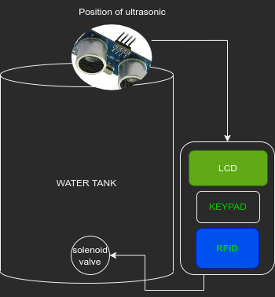
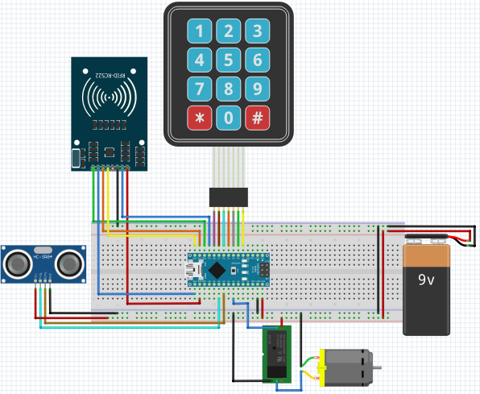

# Water management with RFID
Water management system allowing one to scan RFID tag to get access

# Project Idea

This project is to monitor water usage to houses that uses shared water tank. The project has users of two levels, admin and customer.

**Admin**
  - Recharge customer card
  - Set water price

**Cutomer**
  - Scan card to buy water
 
 **ILLUSTRATION DIAGRAM**
 

**FRITZING DIAGRAM**

